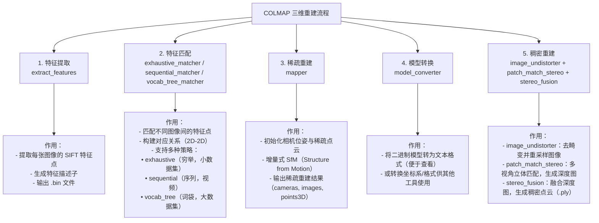

# :rocket: Project Guide :rocket:

The 3DRepo repository is mainly used to reproduce currently cutting-edge 3D reconstruction technologies, including implicit technologies such as Nerf, MipNerf, Tri-MipNerf, and explicit technical models such as 3D Gaussian Splatting, 2D Gaussian Splatting, and Mip-Splatting. The datasets used in the project mainly include datasets like Nerf-Synthetic and Mip-360 (if you need to download the datasets, you can click [Nerf Synthetic](https://drive.google.com/drive/folders/128yBriW1IG_3NJ5Rp7APSTZsJqdJdfc1) and [Mip-360](https://jonbarron.info/mipnerf360/) to download them). Additionally, the project also includes processing methods and visualization operations for these data. You can view the performance of these models on real datasets by watching the effects of specific synthetic perspectives or checking specific metrics such as PSNR, SSIM, and LPIPS.

## :wrench: 1.Experiment Results :wrench:

We choose the Nerf-Synthetic and Mip-360 dataset to train the 3D Gaussian Splatting, 2D Gassian Splatting, Gaussian Opacity Fields, Mip-Splatting, Analytic-Splatting and 3DGRUT algorithms and make Single-Train-Single-Test(STST), Single-Train-Multiple-Test(STMT) experiments to get metrics about PSNR, SSIM, LPIPS to compare the performance of algorithms. The detailed results of these experiments are as follows:

## :mag: 2.Colmap Tool :mag:

Colmap first reconstructs the sparse 3D structure and camera poses through SfM, then uses MVS to densify the sparse points, and finally outputs a dense point cloud or mesh. Overall, Colmap's entire pipeline is accelerated by a CPU/GPU hybrid, with high precision, robustness, and open-source availability, making it the "offline reconstruction baseline" in academia and industry. The specific process for installing the GPU version of Colmap on Linux (taking Ubuntu 22.04 as an example) is as follows:

```bash
# Install the compilation dependencies
sudo apt update
sudo apt install -y gcc-11 g++-11
git clone https://github.com/colmap/colmap.git
cd colmap

#If you encounter compilation issues with PoseLib, you need to manually download the PoseLib source code package.
cd ~/colmap
wget https://github.com/PoseLib/PoseLib/archive/f119951fca625133112acde48daffa5f20eba451.zip
# Unzip to the diectional floder
unzip -q f119951fca625133112acde48daffa5f20eba451.zip
mv PoseLib-f119951fca625133112acde48daffa5f20eba451 \
   build/_deps/poselib-src

# Rebuild and trigger CMake
cd build
cmake .. -GNinja \
  -DCMAKE_BUILD_TYPE=Release \
  -DCMAKE_CUDA_ARCHITECTURES=86 \
  -DBUILD_TESTING=OFF \
  -DBUILD_EXAMPLES=OFF \
  -DCMAKE_C_COMPILER=gcc-11 \
  -DCMAKE_CXX_COMPILER=g++-11

# Continuing to compilation
ninja -j4
sudo ninja install
colmap patch_match_stereo --help | grep gpu
```



