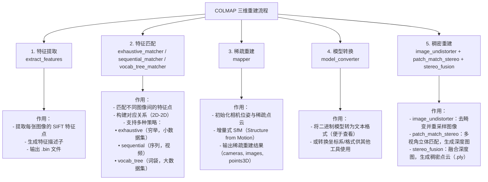

# :rocket: Project Guide :rocket:

The 3DRepo repository is mainly used to reproduce currently cutting-edge 3D reconstruction technologies, including implicit technologies such as Nerf, MipNerf, Tri-MipNerf, and explicit technical models such as 3D Gaussian Splatting, 2D Gaussian Splatting, and Mip-Splatting. The datasets used in the project mainly include datasets like Nerf-Synthetic and Mip-360 (if you need to download the datasets, you can click [Nerf Synthetic](https://drive.google.com/drive/folders/128yBriW1IG_3NJ5Rp7APSTZsJqdJdfc1) and [Mip-360](https://jonbarron.info/mipnerf360/) to download them). Additionally, the project also includes processing methods and visualization operations for these data. You can view the performance of these models on real datasets by watching the effects of specific synthetic perspectives or checking specific metrics such as PSNR, SSIM, and LPIPS.

## :wrench: 1.Experiment Results :wrench:

We choose the Nerf-Synthetic and Mip-360 dataset to train the 3D Gaussian Splatting, 2D Gassian Splatting, Gaussian Opacity Fields, Mip-Splatting, Analytic-Splatting and 3DGRUT algorithms and make Single-Train-Single-Test(STST), Single-Train-Multiple-Test(STMT) experiments to get metrics about PSNR, SSIM, LPIPS to compare the performance of algorithms. The detailed results of these experiments are as follows:

| STST-R1                                                          | Unnamed: 1   | Unnamed: 2   | Unnamed: 3   | Unnamed: 4   | Unnamed: 5   | Unnamed: 6   | Unnamed: 7   | Unnamed: 8   | Unnamed: 9   |
|:-----------------------------------------------------------------|:-------------|:-------------|:-------------|:-------------|:-------------|:-------------|:-------------|:-------------|:-------------|
| PSNR                                                             | chair        | drums        | ficus        | hotdog       | lego         | materials    | mic          | ship         | Mean         |
| 3DGRT                                                            | 35.38        | 25.72        | 36.51        | 37.86        | 36.72        | 30.39        | 35.83        | 31.68        | 33.76        |
| 3DGUT                                                            | 35.43        | 25.92        | 36.39        | 38.06        | 36.30        | 30.38        | 36.44        | 31.62        | 33.82        |
| GOF                                                              | 35.79        | 26.27        | 35.86        | 37.26        | 35.92        | 30.32        | 36.62        | 31.60        | 33.71        |
| 2DGS                                                             | 34.77        | 24.56        | 35.79        | 36.99        | 32.79        | 30.12        | 34.21        | 30.05        | 32.41        |
| 3DGS                                                             | 31.93        | 24.91        | 29.05        | 36.50        | 32.38        | 29.69        | 34.66        | 29.55        | 31.08        |
| Analytic-Splatting                                               | 36.50        | 26.35        | 36.34        | 38.05        | 36.43        | 27.72        | 31.62        | 31.22        | 33.03        |
| Mip-Splatting                                                    | 35.68        | 26.35        | 35.89        | 38.24        | 36.38        | 30.66        | 37.02        | 31.73        | 33.99        |
| 3d-mip-splatting                                                 | 36.20        | 26.37        | 36.57        | 38.32        | 36.93        | 30.69        | 36.43        | 31.98        | 34.18        |
| SSIM                                                             | chair        | drums        | ficus        | hotdog       | lego         | materials    | mic          | ship         | Mean         |
| 3DGRT                                                            | 0.99         | 0.95         | 0.99         | 0.99         | 0.98         | 0.96         | 0.99         | 0.91         | 0.97         |
| 3DGUT                                                            | 0.99         | 0.95         | 0.99         | 0.99         | 0.98         | 0.96         | 0.99         | 0.91         | 0.97         |
| GOF                                                              | 0.99         | 0.96         | 0.99         | 0.99         | 0.98         | 0.96         | 0.99         | 0.91         | 0.97         |
| 2DGS                                                             | 0.99         | 0.93         | 0.99         | 0.98         | 0.97         | 0.96         | 0.99         | 0.88         | 0.96         |
| 3DGS                                                             | 0.98         | 0.94         | 0.95         | 0.98         | 0.98         | 0.95         | 0.99         | 0.90         | 0.96         |
| Analytic-Splatting                                               | 0.99         | 0.96         | 0.99         | 0.99         | 0.98         | 0.95         | 0.98         | 0.91         | 0.97         |
| Mip-Splatting                                                    | 0.99         | 0.96         | 0.99         | 0.99         | 0.98         | 0.96         | 0.99         | 0.91         | 0.97         |
| 3d-mip-splatting                                                 | 0.99         | 0.96         | 0.99         | 0.99         | 0.98         | 0.96         | 0.99         | 0.91         | 0.97         |
| LPIPS                                                            | chair        | drums        | ficus        | hotdog       | lego         | materials    | mic          | ship         | Mean         |
| 3DGRT                                                            | 0.01         | 0.05         | 0.01         | 0.02         | 0.02         | 0.05         | 0.01         | 0.12         | 0.04         |
| 3DGUT                                                            | 0.01         | 0.05         | 0.01         | 0.03         | 0.02         | 0.05         | 0.01         | 0.13         | 0.04         |
| GOF                                                              | 0.01         | 0.04         | 0.01         | 0.02         | 0.02         | 0.04         | 0.01         | 0.10         | 0.03         |
| 2DGS                                                             | 0.01         | 0.06         | 0.01         | 0.02         | 0.03         | 0.04         | 0.01         | 0.13         | 0.04         |
| 3DGS                                                             | 0.02         | 0.06         | 0.04         | 0.03         | 0.03         | 0.06         | 0.03         | 0.13         | 0.05         |
| Analytic-Splatting                                               | 0.01         | 0.04         | 0.01         | 0.02         | 0.01         | 0.05         | 0.01         | 0.10         | 0.03         |
| Mip-Splatting                                                    | 0.01         | 0.04         | 0.01         | 0.02         | 0.01         | 0.04         | 0.01         | 0.10         | 0.03         |
| 3d-mip-splatting                                                 | 0.01         | 0.04         | 0.01         | 0.02         | 0.01         | 0.04         | 0.01         | 0.10         | 0.03         |
| STST-R2                                                          |              |              |              |              |              |              |              |              |              |
| PSNR                                                             | chair        | drums        | ficus        | hotdog       | lego         | materials    | mic          | ship         | Mean         |
| GOF                                                              | 38.71        | 27.37        | 34.89        | 39.23        | 36.53        | 31.81        | 39.29        | 33.67        | 35.19        |
| 2DGS                                                             | 36.80        | 25.78        | 34.11        | 38.22        | 34.45        | 31.31        | 36.68        | 32.15        | 33.69        |
| 3DGS                                                             | 32.79        | 25.06        | 28.13        | 37.25        | 32.16        | 30.78        | 34.48        | 29.80        | 31.31        |
| Analytic-Splatting                                               | 39.38        | 27.39        | 35.69        | 40.10        | 37.29        | 31.38        | 38.09        | 32.91        | 35.28        |
| Mip-Splatting                                                    | 38.40        | 27.33        | 34.57        | 40.34        | 36.79        | 32.04        | 39.57        | 33.77        | 35.35        |
| 3d-mip-splatting                                                 | 38.46        | 27.32        | 35.99        | 40.39        | 37.46        | 31.85        | 38.85        | 33.95        | 35.53        |
| SSIM                                                             | chair        | drums        | ficus        | hotdog       | lego         | materials    | mic          | ship         | Mean         |
| GOF                                                              | 0.99         | 0.96         | 0.99         | 0.99         | 0.99         | 0.97         | 0.99         | 0.93         | 0.98         |
| 2DGS                                                             | 0.99         | 0.94         | 0.99         | 0.99         | 0.98         | 0.97         | 0.99         | 0.92         | 0.97         |
| 3DGS                                                             | 0.99         | 0.94         | 0.96         | 0.99         | 0.98         | 0.96         | 0.99         | 0.92         | 0.97         |
| Analytic-Splatting                                               | 0.99         | 0.96         | 0.99         | 0.99         | 0.99         | 0.97         | 0.99         | 0.93         | 0.98         |
| Mip-Splatting                                                    | 0.99         | 0.96         | 0.99         | 0.99         | 0.99         | 0.97         | 0.99         | 0.93         | 0.98         |
| 3d-mip-splatting                                                 | 0.99         | 0.96         | 0.99         | 0.99         | 0.99         | 0.97         | 0.99         | 0.93         | 0.98         |
| LPIPS                                                            | chair        | drums        | ficus        | hotdog       | lego         | materials    | mic          | ship         | Mean         |
| GOF                                                              | 0.01         | 0.03         | 0.01         | 0.01         | 0.01         | 0.02         | 0.00         | 0.06         | 0.02         |
| 2DGS                                                             | 0.01         | 0.05         | 0.01         | 0.02         | 0.01         | 0.02         | 0.01         | 0.07         | 0.03         |
| 3DGS                                                             | 0.02         | 0.05         | 0.04         | 0.02         | 0.02         | 0.03         | 0.02         | 0.09         | 0.04         |
| Analytic-Splatting                                               | 0.01         | 0.03         | 0.01         | 0.01         | 0.01         | 0.02         | 0.00         | 0.06         | 0.02         |
| Mip-Splatting                                                    | 0.01         | 0.03         | 0.01         | 0.01         | 0.01         | 0.02         | 0.00         | 0.06         | 0.02         |
| 3d-mip-splatting                                                 | 0.01         | 0.03         | 0.01         | 0.01         | 0.01         | 0.02         | 0.00         | 0.06         | 0.02         |
| STST-R4                                                          |              |              |              |              |              |              |              |              |              |
| PSNR                                                             | chair        | drums        | ficus        | hotdog       | lego         | materials    | mic          | ship         | Mean         |
| GOF                                                              | 39.73        | 28.40        | 33.82        | 40.57        | 36.54        | 33.53        | 41.59        | 35.26        | 36.18        |
| 2DGS                                                             | 37.07        | 27.60        | 31.90        | 38.91        | 34.09        | 32.22        | 38.57        | 33.58        | 34.24        |
| 3DGS                                                             | 30.80        | 24.44        | 26.84        | 36.32        | 30.19        | 30.76        | 32.54        | 28.97        | 30.11        |
| Analytic-Splatting                                               | 37.94        | 27.38        | 32.43        | 37.19        | 34.19        | 30.36        | 34.69        | 29.88        | 33.01        |
| Mip-Splatting                                                    | 39.43        | 28.27        | 33.37        | 41.52        | 36.44        | 33.66        | 41.83        | 35.26        | 36.22        |
| 3d-mip-splatting                                                 | 39.62        | 28.18        | 34.97        | 41.54        | 36.98        | 32.94        | 41.26        | 35.23        | 36.34        |
| SSIM                                                             | chair        | drums        | ficus        | hotdog       | lego         | materials    | mic          | ship         | Mean         |
| GOF                                                              | 1.00         | 0.97         | 0.99         | 0.99         | 0.99         | 0.98         | 0.99         | 0.95         | 0.98         |
| 2DGS                                                             | 0.99         | 0.96         | 0.98         | 0.99         | 0.98         | 0.98         | 0.99         | 0.94         | 0.98         |
| 3DGS                                                             | 0.99         | 0.94         | 0.95         | 0.99         | 0.98         | 0.97         | 0.98         | 0.92         | 0.96         |
| Analytic-Splatting                                               | 0.99         | 0.96         | 0.99         | 0.99         | 0.99         | 0.98         | 0.99         | 0.93         | 0.98         |
| Mip-Splatting                                                    | 1.00         | 0.96         | 0.99         | 0.99         | 0.99         | 0.98         | 0.99         | 0.95         | 0.98         |
| 3d-mip-splatting                                                 | 1.00         | 0.96         | 0.99         | 0.99         | 0.99         | 0.98         | 0.99         | 0.94         | 0.98         |
| LPIPS                                                            | chair        | drums        | ficus        | hotdog       | lego         | materials    | mic          | ship         | Mean         |
| GOF                                                              | 0.00         | 0.03         | 0.01         | 0.01         | 0.01         | 0.01         | 0.00         | 0.04         | 0.01         |
| 2DGS                                                             | 0.01         | 0.04         | 0.02         | 0.01         | 0.02         | 0.02         | 0.01         | 0.05         | 0.02         |
| 3DGS                                                             | 0.02         | 0.06         | 0.04         | 0.02         | 0.03         | 0.03         | 0.03         | 0.07         | 0.04         |
| Analytic-Splatting                                               | 0.01         | 0.03         | 0.01         | 0.01         | 0.01         | 0.02         | 0.01         | 0.05         | 0.02         |
| Mip-Splatting                                                    | 0.00         | 0.03         | 0.01         | 0.01         | 0.01         | 0.01         | 0.01         | 0.04         | 0.01         |
| 3d-mip-splatting                                                 | 0.00         | 0.03         | 0.01         | 0.01         | 0.01         | 0.01         | 0.01         | 0.04         | 0.01         |
| STST-R8                                                          |              |              |              |              |              |              |              |              |              |
| PSNR                                                             | chair        | drums        | ficus        | hotdog       | lego         | materials    | mic          | ship         | Mean         |
| GOF                                                              | 39.62        | 29.52        | 34.09        | 41.36        | 36.65        | 35.52        | 42.95        | 36.87        | 37.07        |
| 2DGS                                                             | 28.49        | 27.74        | 31.23        | 38.40        | 32.74        | 33.07        | 39.33        | 34.44        | 33.18        |
| 3DGS                                                             | 28.34        | 23.36        | 25.99        | 34.18        | 28.09        | 29.63        | 29.87        | 27.70        | 28.39        |
| Analytic-Splatting                                               | 41.96        | 28.07        | 34.01        | 41.74        | 36.35        | 33.40        | 40.31        | 31.10        | 35.87        |
| Mip-Splatting                                                    | 39.24        | 29.38        | 33.81        | 41.90        | 36.56        | 35.61        | 43.16        | 36.96        | 37.08        |
| 3d-mip-splatting                                                 | 39.58        | 29.38        | 34.40        | 41.89        | 36.83        | 34.34        | 42.44        | 36.47        | 36.92        |
| SSIM                                                             | chair        | drums        | ficus        | hotdog       | lego         | materials    | mic          | ship         | Mean         |
| GOF                                                              | 1.00         | 0.97         | 0.99         | 1.00         | 0.99         | 0.99         | 1.00         | 0.97         | 0.99         |
| 2DGS                                                             | 0.96         | 0.96         | 0.97         | 0.99         | 0.98         | 0.98         | 0.99         | 0.96         | 0.97         |
| 3DGS                                                             | 0.98         | 0.93         | 0.94         | 0.99         | 0.97         | 0.96         | 0.97         | 0.92         | 0.96         |
| Analytic-Splatting                                               | 1.00         | 0.97         | 0.99         | 1.00         | 0.99         | 0.99         | 1.00         | 0.94         | 0.98         |
| Mip-Splatting                                                    | 1.00         | 0.97         | 0.99         | 1.00         | 0.99         | 0.99         | 1.00         | 0.96         | 0.99         |
| 3d-mip-splatting                                                 | 1.00         | 0.97         | 0.99         | 1.00         | 0.99         | 0.99         | 1.00         | 0.96         | 0.99         |
| LPIPS                                                            | chair        | drums        | ficus        | hotdog       | lego         | materials    | mic          | ship         | Mean         |
| GOF                                                              | 0.00         | 0.03         | 0.01         | 0.00         | 0.01         | 0.01         | 0.00         | 0.03         | 0.01         |
| 2DGS                                                             | 0.04         | 0.04         | 0.02         | 0.01         | 0.02         | 0.01         | 0.01         | 0.04         | 0.03         |
| 3DGS                                                             | 0.02         | 0.08         | 0.04         | 0.02         | 0.03         | 0.03         | 0.05         | 0.07         | 0.04         |
| Analytic-Splatting                                               | 0.00         | 0.03         | 0.01         | 0.00         | 0.01         | 0.01         | 0.00         | 0.04         | 0.01         |
| Mip-Splatting                                                    | 0.00         | 0.03         | 0.01         | 0.00         | 0.01         | 0.01         | 0.00         | 0.03         | 0.01         |
| 3d-mip-splatting                                                 | 0.00         | 0.03         | 0.01         | 0.00         | 0.01         | 0.01         | 0.01         | 0.03         | 0.01         |
| STMT-R1(每一个算法对应四行自上而下分别为R_1/2/4/8，第五行为均值) |              |              |              |              |              |              |              |              |              |
| PSNR                                                             | chair        | drums        | ficus        | hotdog       | lego         | materials    | mic          | ship         | Mean         |
| GOF                                                              | 35.85        | 26.13        | 35.05        | 37.33        | 26.37        | 30.32        | 36.62        | 31.60        | 32.41        |
|                                                                  | 34.50        | 26.56        | 34.54        | 36.92        | 26.40        | 31.09        | 35.14        | 31.32        | 32.06        |
|                                                                  | 30.83        | 25.42        | 30.67        | 33.56        | 25.51        | 30.46        | 31.44        | 29.07        | 29.62        |
|                                                                  | 27.85        | 23.30        | 26.14        | 30.23        | 23.79        | 28.28        | 29.51        | 26.86        | 27.00        |
|                                                                  | 32.26        | 25.35        | 31.60        | 34.51        | 25.52        | 30.04        | 33.18        | 29.71        | 30.27        |
| 2DGS                                                             | 27.12        | 26.03        | 35.17        | 37.27        | 33.71        | 29.67        | 34.62        | 30.81        | 31.80        |
|                                                                  | 24.51        | 23.54        | 28.86        | 31.54        | 26.86        | 26.81        | 27.02        | 25.92        | 26.88        |
|                                                                  | 21.10        | 18.14        | 21.14        | 24.24        | 20.02        | 19.41        | 18.74        | 19.20        | 20.25        |
|                                                                  | 18.70        | 14.63        | 17.83        | 19.67        | 16.27        | 14.83        | 14.12        | 15.07        | 16.39        |
|                                                                  | 22.86        | 20.58        | 25.75        | 28.18        | 24.22        | 22.68        | 23.62        | 22.75        | 23.83        |
| 3DGS                                                             | 31.94        | 24.91        | 29.05        | 36.49        | 32.37        | 29.69        | 34.62        | 29.55        | 31.08        |
|                                                                  | 25.17        | 23.23        | 24.23        | 30.90        | 26.99        | 28.69        | 29.07        | 26.71        | 26.87        |
|                                                                  | 20.62        | 20.09        | 21.83        | 25.49        | 22.09        | 25.29        | 25.61        | 23.00        | 23.00        |
|                                                                  | 17.22        | 17.02        | 20.11        | 21.35        | 18.58        | 22.02        | 22.39        | 20.76        | 19.93        |
|                                                                  | 23.74        | 21.31        | 23.80        | 28.56        | 25.01        | 26.42        | 27.92        | 25.01        | 25.22        |
| Analytic-Splatting                                               | 36.51        | 26.34        | 36.33        | 37.97        | 36.44        | 30.06        | 35.29        | 31.19        | 33.77        |
|                                                                  | 37.58        | 27.04        | 35.81        | 38.38        | 34.96        | 30.80        | 35.08        | 31.80        | 33.93        |
|                                                                  | 35.16        | 26.10        | 32.19        | 34.91        | 30.58        | 29.46        | 29.61        | 29.35        | 30.92        |
|                                                                  | 31.51        | 23.70        | 28.24        | 30.68        | 26.52        | 26.16        | 24.40        | 25.69        | 27.11        |
|                                                                  | 35.19        | 25.80        | 33.14        | 35.48        | 32.12        | 29.12        | 31.09        | 29.51        | 31.43        |
| Mip-Splatting                                                    | 35.89        | 26.23        | 35.19        | 37.89        | 35.87        | 30.25        | 35.67        | 30.45        | 33.43        |
|                                                                  | 37.59        | 27.00        | 34.69        | 38.26        | 35.17        | 31.16        | 35.40        | 31.36        | 33.83        |
|                                                                  | 35.69        | 26.49        | 31.91        | 34.88        | 31.32        | 30.28        | 29.82        | 29.58        | 31.24        |
|                                                                  | 31.84        | 24.62        | 28.66        | 30.70        | 27.55        | 27.31        | 24.34        | 26.21        | 27.65        |
|                                                                  | 35.25        | 26.09        | 32.62        | 35.43        | 32.48        | 29.75        | 31.31        | 29.40        | 31.54        |
| 3d-mip-splatting                                                 | 36.37        | 26.25        | 36.06        | 37.98        | 36.44        | 30.21        | 35.27        | 30.66        | 33.65        |
|                                                                  | 35.64        | 27.08        | 34.95        | 37.72        | 35.16        | 30.60        | 34.81        | 30.92        | 33.36        |
|                                                                  | 32.13        | 26.93        | 31.98        | 34.18        | 31.76        | 28.67        | 30.55        | 28.62        | 30.60        |
|                                                                  | 28.87        | 26.07        | 27.99        | 30.65        | 28.78        | 25.42        | 27.09        | 25.58        | 27.56        |
|                                                                  | 33.25        | 26.58        | 32.75        | 35.13        | 33.03        | 28.72        | 31.93        | 28.95        | 31.29        |
| SSIM                                                             | chair        | drums        | ficus        | hotdog       | lego         | materials    | mic          | ship         | Mean         |
| GOF                                                              | 0.99         | 0.96         | 0.99         | 0.99         | 0.95         | 0.96         | 0.99         | 0.91         | 0.97         |
|                                                                  | 0.98         | 0.96         | 0.99         | 0.99         | 0.95         | 0.97         | 0.99         | 0.92         | 0.97         |
|                                                                  | 0.97         | 0.95         | 0.98         | 0.98         | 0.94         | 0.97         | 0.97         | 0.91         | 0.96         |
|                                                                  | 0.96         | 0.93         | 0.96         | 0.97         | 0.92         | 0.96         | 0.96         | 0.88         | 0.94         |
|                                                                  | 0.97         | 0.95         | 0.98         | 0.98         | 0.94         | 0.96         | 0.98         | 0.90         | 0.96         |
| 2DGS                                                             | 0.96         | 0.95         | 0.99         | 0.98         | 0.98         | 0.96         | 0.99         | 0.90         | 0.96         |
|                                                                  | 0.94         | 0.93         | 0.97         | 0.97         | 0.95         | 0.95         | 0.97         | 0.90         | 0.95         |
|                                                                  | 0.86         | 0.80         | 0.89         | 0.91         | 0.83         | 0.85         | 0.87         | 0.79         | 0.85         |
|                                                                  | 0.76         | 0.62         | 0.79         | 0.80         | 0.70         | 0.70         | 0.72         | 0.63         | 0.71         |
|                                                                  | 0.88         | 0.82         | 0.91         | 0.92         | 0.86         | 0.86         | 0.89         | 0.81         | 0.87         |
| 3DGS                                                             | 0.98         | 0.94         | 0.95         | 0.98         | 0.98         | 0.95         | 0.99         | 0.90         | 0.96         |
|                                                                  | 0.95         | 0.91         | 0.92         | 0.97         | 0.94         | 0.95         | 0.97         | 0.89         | 0.94         |
|                                                                  | 0.89         | 0.84         | 0.87         | 0.93         | 0.85         | 0.91         | 0.92         | 0.84         | 0.88         |
|                                                                  | 0.79         | 0.72         | 0.81         | 0.85         | 0.75         | 0.84         | 0.83         | 0.75         | 0.79         |
|                                                                  | 0.90         | 0.85         | 0.89         | 0.93         | 0.88         | 0.91         | 0.93         | 0.85         | 0.89         |
| Analytic-Splatting                                               | 0.99         | 0.96         | 0.99         | 0.99         | 0.98         | 0.96         | 0.99         | 0.91         | 0.97         |
|                                                                  | 0.99         | 0.96         | 0.99         | 0.99         | 0.99         | 0.97         | 0.99         | 0.93         | 0.98         |
|                                                                  | 0.99         | 0.95         | 0.99         | 0.99         | 0.98         | 0.98         | 0.98         | 0.94         | 0.98         |
|                                                                  | 0.98         | 0.93         | 0.98         | 0.98         | 0.96         | 0.97         | 0.97         | 0.94         | 0.96         |
|                                                                  | 0.99         | 0.95         | 0.99         | 0.99         | 0.98         | 0.97         | 0.98         | 0.93         | 0.97         |
| Mip-Splatting                                                    | 0.99         | 0.96         | 0.99         | 0.99         | 0.98         | 0.96         | 0.99         | 0.90         | 0.97         |
|                                                                  | 0.99         | 0.96         | 0.99         | 0.99         | 0.99         | 0.97         | 0.99         | 0.92         | 0.98         |
|                                                                  | 0.99         | 0.96         | 0.99         | 0.99         | 0.98         | 0.98         | 0.98         | 0.93         | 0.98         |
|                                                                  | 0.98         | 0.95         | 0.98         | 0.98         | 0.97         | 0.98         | 0.97         | 0.94         | 0.97         |
|                                                                  | 0.99         | 0.95         | 0.99         | 0.99         | 0.98         | 0.97         | 0.98         | 0.92         | 0.97         |
| 3d-mip-splatting                                                 | 0.99         | 0.96         | 0.99         | 0.99         | 0.98         | 0.96         | 0.99         | 0.90         | 0.97         |
|                                                                  | 0.99         | 0.96         | 0.99         | 0.99         | 0.99         | 0.97         | 0.99         | 0.92         | 0.97         |
|                                                                  | 0.98         | 0.96         | 0.98         | 0.98         | 0.98         | 0.97         | 0.98         | 0.92         | 0.97         |
|                                                                  | 0.97         | 0.95         | 0.97         | 0.97         | 0.97         | 0.97         | 0.98         | 0.90         | 0.96         |
|                                                                  | 0.98         | 0.95         | 0.98         | 0.98         | 0.98         | 0.97         | 0.99         | 0.91         | 0.97         |
| LPIPS                                                            | chair        | drums        | ficus        | hotdog       | lego         | materials    | mic          | ship         | Mean         |
| GOF                                                              | 0.01         | 0.04         | 0.01         | 0.02         | 0.03         | 0.04         | 0.01         | 0.10         | 0.03         |
|                                                                  | 0.02         | 0.03         | 0.01         | 0.02         | 0.03         | 0.02         | 0.01         | 0.07         | 0.03         |
|                                                                  | 0.04         | 0.06         | 0.02         | 0.04         | 0.05         | 0.03         | 0.05         | 0.08         | 0.05         |
|                                                                  | 0.07         | 0.09         | 0.06         | 0.06         | 0.11         | 0.05         | 0.10         | 0.13         | 0.08         |
|                                                                  | 0.04         | 0.06         | 0.03         | 0.03         | 0.06         | 0.03         | 0.04         | 0.10         | 0.05         |
| 2DGS                                                             | 0.05         | 0.04         | 0.01         | 0.02         | 0.02         | 0.04         | 0.01         | 0.12         | 0.04         |
|                                                                  | 0.06         | 0.05         | 0.02         | 0.03         | 0.03         | 0.03         | 0.02         | 0.09         | 0.04         |
|                                                                  | 0.11         | 0.12         | 0.08         | 0.05         | 0.09         | 0.06         | 0.07         | 0.13         | 0.09         |
|                                                                  | 0.16         | 0.23         | 0.15         | 0.10         | 0.17         | 0.13         | 0.15         | 0.20         | 0.16         |
|                                                                  | 0.09         | 0.11         | 0.07         | 0.05         | 0.08         | 0.06         | 0.06         | 0.14         | 0.08         |
| 3DGS                                                             | 0.02         | 0.06         | 0.04         | 0.03         | 0.03         | 0.06         | 0.03         | 0.13         | 0.05         |
|                                                                  | 0.03         | 0.06         | 0.05         | 0.03         | 0.04         | 0.04         | 0.03         | 0.10         | 0.05         |
|                                                                  | 0.06         | 0.10         | 0.07         | 0.04         | 0.09         | 0.05         | 0.06         | 0.11         | 0.07         |
|                                                                  | 0.10         | 0.16         | 0.09         | 0.08         | 0.14         | 0.08         | 0.10         | 0.15         | 0.11         |
|                                                                  | 0.05         | 0.09         | 0.07         | 0.04         | 0.08         | 0.06         | 0.05         | 0.12         | 0.07         |
| Analytic-Splatting                                               | 0.01         | 0.04         | 0.01         | 0.02         | 0.01         | 0.03         | 0.01         | 0.11         | 0.03         |
|                                                                  | 0.01         | 0.03         | 0.01         | 0.01         | 0.01         | 0.02         | 0.01         | 0.06         | 0.02         |
|                                                                  | 0.01         | 0.04         | 0.01         | 0.01         | 0.02         | 0.02         | 0.03         | 0.05         | 0.02         |
|                                                                  | 0.02         | 0.06         | 0.03         | 0.03         | 0.04         | 0.03         | 0.05         | 0.06         | 0.04         |
|                                                                  | 0.01         | 0.04         | 0.01         | 0.02         | 0.02         | 0.03         | 0.02         | 0.07         | 0.03         |
| Mip-Splatting                                                    | 0.01         | 0.04         | 0.01         | 0.02         | 0.02         | 0.03         | 0.01         | 0.11         | 0.03         |
|                                                                  | 0.01         | 0.03         | 0.01         | 0.01         | 0.01         | 0.02         | 0.01         | 0.06         | 0.02         |
|                                                                  | 0.01         | 0.04         | 0.01         | 0.01         | 0.02         | 0.01         | 0.02         | 0.05         | 0.02         |
|                                                                  | 0.02         | 0.05         | 0.02         | 0.02         | 0.03         | 0.02         | 0.04         | 0.05         | 0.03         |
|                                                                  | 0.01         | 0.04         | 0.01         | 0.02         | 0.02         | 0.02         | 0.02         | 0.07         | 0.03         |
| 3d-mip-splatting                                                 | 0.01         | 0.04         | 0.01         | 0.02         | 0.01         | 0.03         | 0.01         | 0.11         | 0.03         |
|                                                                  | 0.01         | 0.03         | 0.01         | 0.01         | 0.01         | 0.02         | 0.01         | 0.07         | 0.02         |
|                                                                  | 0.02         | 0.04         | 0.02         | 0.02         | 0.02         | 0.03         | 0.03         | 0.06         | 0.03         |
|                                                                  | 0.04         | 0.05         | 0.03         | 0.03         | 0.04         | 0.05         | 0.04         | 0.08         | 0.04         |
|                                                                  | 0.02         | 0.04         | 0.02         | 0.02         | 0.02         | 0.03         | 0.02         | 0.08         | 0.03         |
| MTMT(每一个算法对应四行自上而下分别为R_1/2/4/8，第五行为均值)    |              |              |              |              |              |              |              |              |              |
| PSNR                                                             | chair        | drums        | ficus        | hotdog       | lego         | materials    | mic          | ship         | Mean         |
| mip-gof                                                          | 35.96        | 27.65        | 34.68        | 38.67        | 34.66        | 31.97        | 37.33        | 33.02        | 34.24        |
|                                                                  | 33.82        | 27.72        | 33.05        | 36.38        | 32.88        | 32.66        | 36.84        | 33.36        | 33.34        |
|                                                                  | 30.93        | 26.94        | 30.29        | 33.63        | 30.34        | 32.31        | 35.35        | 32.48        | 31.54        |
|                                                                  | 27.24        | 25.07        | 26.55        | 29.83        | 26.39        | 30.35        | 32.74        | 30.05        | 28.53        |
|                                                                  | 31.99        | 26.85        | 31.14        | 34.63        | 31.07        | 31.82        | 35.56        | 32.23        | 31.91        |
| 2DGS                                                             |              |              |              |              |              |              |              |              |              |
| 3DGS                                                             |              |              |              |              |              |              |              |              |              |
| Analytic-Splatting                                               |              |              |              |              |              |              |              |              |              |
| Mip-Splatting                                                    |              |              |              |              |              |              |              |              |              |
| 3d-mip-splatting                                                 |              |              |              |              |              |              |              |              |              |
| SSIM                                                             | chair        | drums        | ficus        | hotdog       | lego         | materials    | mic          | ship         | Mean         |
| mip-gof                                                          | 0.99         | 0.96         | 0.99         | 0.99         | 0.98         | 0.97         | 0.99         | 0.93         | 0.97         |
|                                                                  | 0.99         | 0.96         | 0.98         | 0.99         | 0.98         | 0.98         | 0.98         | 0.95         | 0.98         |
|                                                                  | 0.97         | 0.92         | 0.94         | 0.98         | 0.97         | 0.98         | 0.95         | 0.94         | 0.96         |
|                                                                  | 0.93         | 0.84         | 0.80         | 0.96         | 0.90         | 0.95         | 0.89         | 0.90         | 0.90         |
|                                                                  | 0.97         | 0.92         | 0.93         | 0.98         | 0.96         | 0.97         | 0.95         | 0.93         | 0.95         |
| 2DGS                                                             |              |              |              |              |              |              |              |              |              |
| 3DGS                                                             |              |              |              |              |              |              |              |              |              |
| Analytic-Splatting                                               |              |              |              |              |              |              |              |              |              |
| Mip-Splatting                                                    |              |              |              |              |              |              |              |              |              |
| 3d-mip-splatting                                                 |              |              |              |              |              |              |              |              |              |
| LPIPS                                                            | chair        | drums        | ficus        | hotdog       | lego         | materials    | mic          | ship         | Mean         |
| mip-gof                                                          | 0.01         | 0.03         | 0.01         | 0.02         | 0.02         | 0.03         | 0.01         | 0.07         | 0.03         |
|                                                                  | 0.02         | 0.04         | 0.02         | 0.02         | 0.03         | 0.02         | 0.02         | 0.05         | 0.03         |
|                                                                  | 0.02         | 0.04         | 0.03         | 0.02         | 0.03         | 0.01         | 0.04         | 0.04         | 0.03         |
|                                                                  | 0.07         | 0.11         | 0.09         | 0.07         | 0.10         | 0.05         | 0.07         | 0.09         | 0.08         |
|                                                                  | 0.03         | 0.06         | 0.04         | 0.03         | 0.04         | 0.03         | 0.03         | 0.06         | 0.04         |
| 2DGS                                                             |              |              |              |              |              |              |              |              |              |
| 3DGS                                                             |              |              |              |              |              |              |              |              |              |
| Analytic-Splatting                                               |              |              |              |              |              |              |              |              |              |
| Mip-Splatting                                                    |              |              |              |              |              |              |              |              |              |
| 3d-mip-splatting                                                 |              |              |              |              |              |              |              |              |              |

## :mag: 2.Colmap Tool :mag:

Colmap first reconstructs the sparse 3D structure and camera poses through SfM, then uses MVS to densify the sparse points, and finally outputs a dense point cloud or mesh. Overall, Colmap's entire pipeline is accelerated by a CPU/GPU hybrid, with high precision, robustness, and open-source availability, making it the "offline reconstruction baseline" in academia and industry. The specific process for installing the GPU version of Colmap on Linux (taking Ubuntu 22.04 as an example) is as follows:

```bash
# Install the compilation dependencies
sudo apt update
sudo apt install -y gcc-11 g++-11
git clone https://github.com/colmap/colmap.git
cd colmap

#If you encounter compilation issues with PoseLib, you need to manually download the PoseLib source code package.
cd ~/colmap
wget https://github.com/PoseLib/PoseLib/archive/f119951fca625133112acde48daffa5f20eba451.zip
# Unzip to the diectional floder
unzip -q f119951fca625133112acde48daffa5f20eba451.zip
mv PoseLib-f119951fca625133112acde48daffa5f20eba451 \
   build/_deps/poselib-src

# Rebuild and trigger CMake
cd build
cmake .. -GNinja \
  -DCMAKE_BUILD_TYPE=Release \
  -DCMAKE_CUDA_ARCHITECTURES=86 \
  -DBUILD_TESTING=OFF \
  -DBUILD_EXAMPLES=OFF \
  -DCMAKE_C_COMPILER=gcc-11 \
  -DCMAKE_CXX_COMPILER=g++-11

# Continuing to compilation
ninja -j4
sudo ninja install
colmap patch_match_stereo --help | grep gpu
```


```mermaid
flowchart TD
    A[COLMAP 三维重建流程] --> B[1. 特征提取\nextract_features]
    A --> C[2. 特征匹配\nexhaustive_matcher / sequential_matcher / vocab_tree_matcher]
    A --> D[3. 稀疏重建\nmapper]
    A --> E[4. 模型转换\nmodel_converter]
    A --> F[5. 稠密重建\nimage_undistorter + patch_match_stereo + stereo_fusion]
    B --> B1["作用：\n- 提取每张图像的 SIFT 特征点\n- 生成特征描述子\n- 输出 .bin 文件"]
    C --> C1["作用：\n- 匹配不同图像间的特征点\n- 构建对应关系（2D-2D）\n- 支持多种策略：\n  • exhaustive（穷举，小数据集）\n  • sequential（序列，视频）\n  • vocab_tree（词袋，大数据集）"]
    D --> D1["作用：\n- 初始化相机位姿与稀疏点云\n- 增量式 SfM（Structure from Motion）\n- 输出稀疏重建结果（cameras, images, points3D）"]
    E --> E1["作用：\n- 将二进制模型转为文本格式（便于查看）\n- 或转换坐标系/格式供其他工具使用"]
    F --> F1["作用：\n- image_undistorter：去畸变并重采样图像\n- patch_match_stereo：多视角立体匹配，生成深度图\n- stereo_fusion：融合深度图，生成稠密点云（.ply）"]
```

